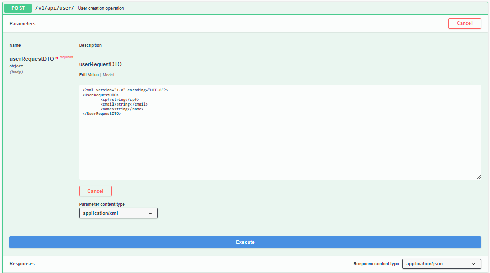
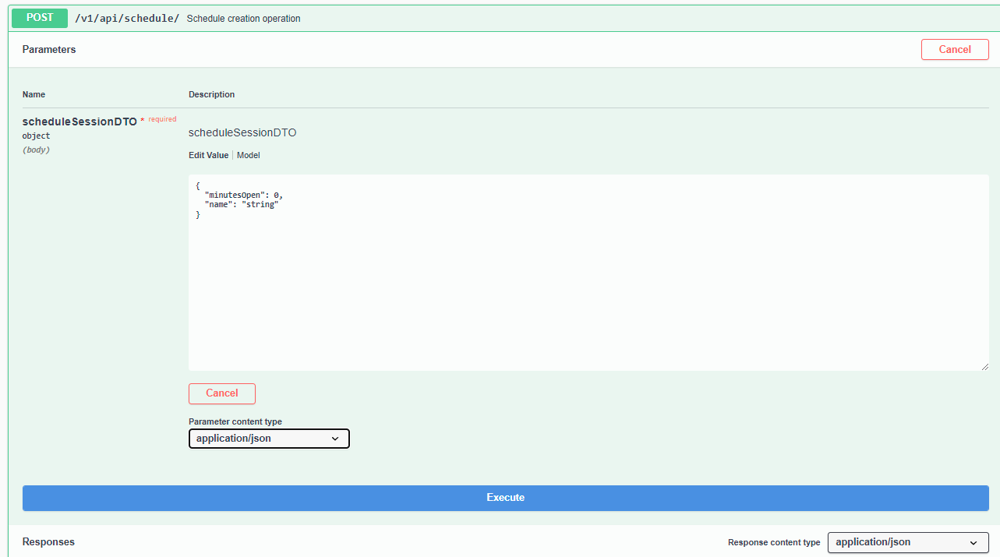
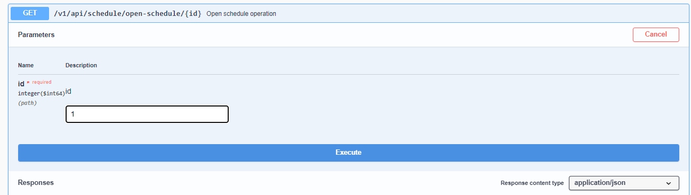
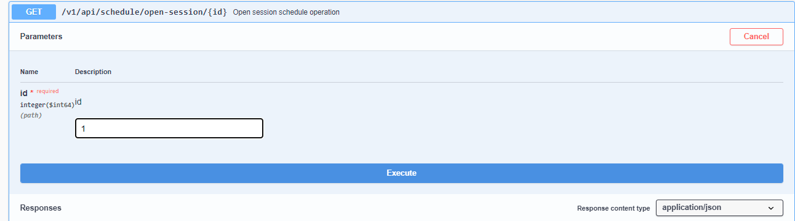
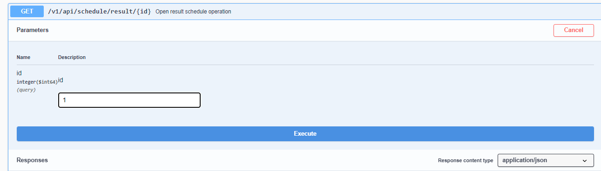

## Aqui vão algumas informações sobre aplicação passo a passo.

Informações sobre os status

```java
@Getter
@NoArgsConstructor
public enum ActiveVote {
    EV("ESPERANDO VOTAÇÃO"),
    VF("VOTAÇÃO FINALIZADA"),
    AIS("AGUARDANDO INICIO DA SESSÃO"),
    AAP("AGUARDANDO ABERTURA DA PAUTA");

    private String description;

    ActiveVote(String description) {
        this.description = description;
    }
}
```

OBS: Você não conseguira votar duas vezes na mesma pauta, quando você votar em uma pauta, o seu usuario vai estar com status: (UNABLE_TO_VOTE)
Não é possivel abrir uma sessão sem ter aberto a pauta.

Imagens meramente ilustrativas, para fins de demonstração, faça o teste por si mesmo para avaliação.

## Primeiro crie um usuario
Usuario precisa ter um e-mail valido, e um CPF valido sem pontuação, é importante destacar que não é possivel criar mais de um usuario com o mesmo CPF/E-MAIL
Para fazer a votação o usuario precisa setar o id da pauta e o id do usuario.



## Crie uma pauta
A pauta pode ter qualquer nome, determine o tempo no qual a pauta vai rodar para que votem nela, quando a sessão for iniciada o tempo vai disparar de acordo
com o padrão passado, caso coloque zero como padrão vai ser setado 1 minuto.



## Abra a pauta
É importante abrir a pauta para que os usuarios possam saber exatamente em quem votar antes que a sessão de votação comece, e estejam preparados para votar
foi implementado essa logica para melhor entendimento das ações dos usuarios.



## Abra a sessão para votação
Abrindo a sessão para votação



## Vote e espere o fim do tempo determinado da pauta
## Veja os resultados

